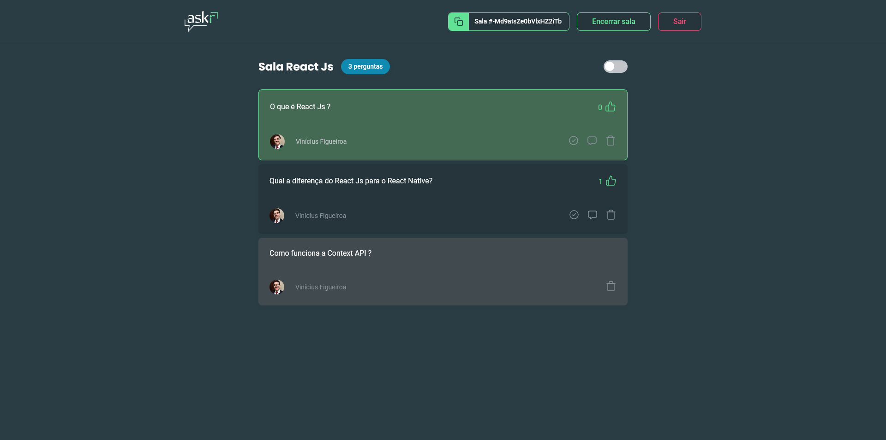
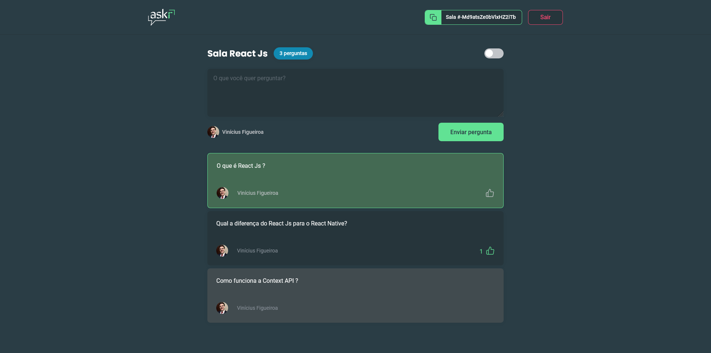

<h1 align="center">
  
</h1>
 
 

  

 

## Sobre o projeto 💬

O **askr** (letmeask) é uma aplicação web de salas de perguntas e respostas ao-vivo, que traz mais proximidade entre um criador de conteúdo e sua audiência!

Como assim? Simples, se um criador de conteúdo está fazendo uma live e começa a surgir dúvidas sobre o assunto abordado, basta criar uma sala para que os espectadores possam fazer suas perguntas!

## Páginas 🔖

Essa aplciação possui apenas uma página e um modal:

<h3 align="center">Home</h3>

  

<h3 align="center">Criar nova sala</h3>

  

<h3 align="center">Sala (criador)</h3>

  

<h3 align="center">Sala (participante)</h3>

  

## Funcionalidades 🧠

A aplicação contém todas as seguintes funcionalidades:

Como criador da sala:

- Dar destaque, marcar como respondida e excluir uma pergunta
- Encerrar sala

Como participante:

- Fazer perguntas
- Dar like nas perguntas

### Funcionalidades extras:

- Tema dark/light
- Fazer login dentro de uma sala
- Fazer logout
- Ordem de classificação das perguntas:
  - 1º Destacadas
  - 2º Número de likes
  - 3º Respondidas

## Como utilizar? 📌

Para utilizar a aplicação em sua máquina é necessário ter os seguintes softwares instalados:

- [Node.js](https://nodejs.org/pt-br/)

Com os software citados acima instalados, basta seguir os seguintes passos para executar a aplicação em sua máquina:

1. **Clonar o projeto**  
   Abra o terminal em uma pasta de sua preferência e cole o seguinte código: _`git clone https://github.com/vinixiii/askr`_

2. **Instalar as depêndencias**  
   Dentro do diretório do projeto, abra o terminal e cole o código: _`npm install`_ ou _`yarn`_

## Tecnologias 🛠

Desenvolvido utilizando as seguintes tecnologias:

- [React](https://reactjs.org)
- [Firebase](https://firebase.google.com/?gclid=CjwKCAjwoNuGBhA8EiwAFxomA_tuHp8Oxg8GU70ang9SYtnMMgl4nIkiYc7hmzzXHauyqmQoEj2z2RoCarIQAvD_BwE&gclsrc=aw.ds)
- [Typescript](https://www.typescriptlang.org/)

---

Feito com ❤ por: Vinícius Figueiroa 🙋🏻‍♂️

